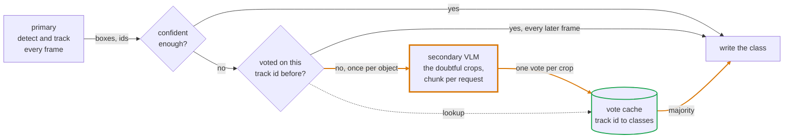

# vizor

[](https://pypi.org/project/vizor/)
[](https://pypi.org/project/vizor/)
[](LICENSE)
[](https://github.com/Y-T-G/vizor/actions/workflows/test.yaml)
[](https://y-t-g.github.io/vizor/)

**A fast detector kept honest by a slower, smarter one.**

[Install](#install) · [Quick start](#quick-start) · [How it works](#how-it-works) ·
[API](#api) · [Write your own](#writing-your-own-model) · [Docs](https://y-t-g.github.io/vizor/)

A small detector runs on every frame but gets classes wrong. A vision-language
model gets them right but is too slow for every frame, and often returns no boxes
at all. Vizor runs both. Boxes and track ids come from the detector, class labels
come from the VLM, and each VLM answer is cached against the track id, so an
object is only sent to the VLM once.

Full documentation is at [y-t-g.github.io/vizor](https://y-t-g.github.io/vizor/).
Everything below runs from this repo, and `examples/` holds each snippet as a
script you can run.

|  | Boxes every frame | Class labels come from | Cost per object |
| --- | --- | --- | --- |
| Small detector alone | yes | the detector | one cheap call per frame |
| VLM alone | no, or slow ones | the VLM | one slow call per frame |
| vizor | yes | the VLM | one slow call per object |

## Install

The core needs numpy and OpenCV only. The model wrappers are optional extras, so
install the one you actually use:

```sh
pip install vizor              # core
pip install "vizor[hf]"        # local Florence-2 or another transformers VLM
pip install "vizor[api]"       # hosted VLMs over OpenAI or Gemini
```

Model wrappers are imported on first use, so `import vizor` never pulls in torch
if you are not using a torch model.

vizor ships no detector. `examples/yolo.py` is a working ultralytics adapter you
copy, and it is not installed. See the header in that file.

## Quick start

A detector on every frame, a hosted VLM on the boxes it is unsure of. `YOLO`
comes from `examples/yolo.py`, not from `vizor`:

```python
import vizor as vz
from yolo import YOLO

# YOLO detects and tracks every frame. The VLM only sees boxes YOLO scored at or
# below conf, cut out and sent up to eight per request. Each answer is cached
# against the track id, so an object costs one call however long it stays in view.
viz = vz.Vizor(
    YOLO("yolo11n.pt"),
    vz.VLM("gemini-3.1-flash-lite", api="gemini"),
    conf=0.5,
    mode="crop",
)

# run() yields the refined boxes for each frame and writes the annotated video
# as it goes. Drop save= and nothing is written.
for out in viz.run("traffic.mp4", save="out.mp4"):
    print(len(out), "boxes")
```

That writes an annotated `out.mp4` and yields the refined boxes for every frame.
The key is read from `GEMINI_API_KEY`, never passed in code.

Florence-2 instead, running locally and grounding the whole frame in one pass:

```python
import vizor as vz
from yolo import YOLO

# the class list is Florence's prompt, so it looks for these three and nothing else
names = {0: "person", 2: "car", 7: "truck"}

# full mode grounds the whole frame in one pass, then matches Florence's boxes to
# the tracks by IoU. A match overwrites the box and confidence, not just the class.
viz = vz.Vizor(YOLO("yolo11n.pt"), vz.Florence(names=names), conf=0.5, mode="full")

# 0 is the first webcam. show=True opens a window, q or Esc closes it.
for out in viz.run(0, show=True):
    pass
```

Florence gives boxes as well as labels, so the refiner can correct the box too,
not just the class.

To try it with no models at all, replay predictions you saved earlier:

```sh
python examples/replay.py --save out.mp4
```

That runs the refiner over the saved frames and writes an annotated video, so you
can see what the refinement does without loading a model or spending a call.

## How it works



Only the amber box costs real time, and only the bottom path reaches it. A track
takes that path on the frame it first looks doubtful and never again, because the
answer is filed under its id.

Each frame goes through three steps.

1. The primary detects and tracks. You get boxes, confidences, classes and track ids.
2. Tracks at or below `conf` are handed to the secondary. Everything above it is
   left alone.
3. The secondary's answer is recorded as a vote against the track id. The running
   majority overwrites the class on this frame and on every later frame, whether
   or not the secondary runs again.

Step 3 is what makes this affordable. A car that stays in view for 300 frames
costs one VLM call, not 300.

There are two modes.

`mode="full"` runs the secondary on the whole frame, matches its boxes to the
tracks by IoU, and takes its box, confidence and class. Use it when the secondary
localises: Florence-2, a heavier YOLO, any open-vocabulary detector.

`mode="crop"` cuts each low confidence track out of the frame and asks the
secondary what it is. The box stays as the primary drew it and only the class
changes. Use it when the secondary classifies but does not localise, which is
every chat VLM.

The refiner never adds or drops a box. It only rewrites the class, and in full
mode the box and confidence too.

## API

```python
vz.Vizor(primary, secondary=None, conf=0.5, mode="full", names=None, **kw)
```

- `conf` sends tracks at or below this confidence to the secondary.
- `mode` is `"full"` or `"crop"`.
- `names` maps class ids to strings. Defaults to whatever the primary reports.
- `iou` is the minimum overlap to match a secondary box to a track, full mode only.
- `votes` is how many answers to collect per track before the secondary stops
  being asked, crop mode only. Default 1.
- `size` and `hist` cap the vote cache at that many track ids and that many votes
  each.

`viz.run(src, save=None, show=False)` yields refined `Tracks` for every frame of a
file, a camera index, or a stream url. `viz.step(img)` does one frame.
`viz.save(src, out)` runs the whole thing and writes the annotated video.
`viz.reset()` clears the votes and the primary's tracker between videos.

`Tracks` wraps a float32 array of shape `(N, 7)` holding
`[x1, y1, x2, y2, conf, cls, id]`, with `id = -1` for untracked boxes:

```python
out.data              # the raw (N, 7) array
out.boxes             # (N, 4) xyxy, a view, so writing to it edits data
out.conf              # (N,) confidences, also a view
out.cls, out.ids      # (N,) ints, copies, so writing to them changes nothing
out[0]                # one Track
out[out.conf > 0.8]   # a new Tracks holding a copy of the matching rows
out.draw()            # draw the boxes on the frame it came from, return the image
```

Indexing with an int gives you one `Track`. Indexing with a mask or a slice gives
you a new `Tracks`, and because numpy copies on fancy indexing, writing to it does
not touch the original.

Bundled models, all of them secondaries. The primary is yours to bring.

| Model | What it is | Mode | Extra |
| --- | --- | --- | --- |
| `VLM` | any OpenAI-compatible chat endpoint, so OpenAI or Gemini | `crop` | `api` |
| `HF` | a local transformers chat VLM | `crop` | `hf` |
| `Florence` | Florence-2 as an open-vocabulary detector | `full` | `hf` |
| `Pkl` | replays predictions you saved earlier | either | none |

## Writing your own model

Subclass `vizor.Model` and implement the method your role needs. A primary
implements `track`, a full-mode secondary implements `find`, a crop-mode
secondary implements `name`. Anything you leave out raises on the first frame
with a message saying which role is missing, rather than silently doing nothing.

```python
import numpy as np
from vizor import Model, Tracks

class MyDetector(Model):
    # turns class ids into labels when drawing, and becomes the menu the VLM picks from
    names = {0: "person", 1: "car"}

    def track(self, img):
        # img is BGR, the layout OpenCV hands you. Return one row per object as
        # [x1, y1, x2, y2, conf, cls, id], with id = -1 for anything untracked.
        # An untracked row is refined on this frame and never cached.
        return Tracks(np.zeros((0, 7), np.float32), names=self.names)
```

Images handed to your model are BGR, the layout OpenCV gives you. Convert inside
your wrapper if the model wants RGB. `name` returns a class id, or `None` if the
model is not sure, and `None` records no vote.

## Links

- [Full documentation](https://y-t-g.github.io/vizor/), built from the docstrings
- [Caveats](https://y-t-g.github.io/vizor/caveats/), what this does badly and where it breaks
- [Ultralytics](https://docs.ultralytics.com/) for the detector and trackers used in `examples/yolo.py`
- [Florence-2](https://huggingface.co/microsoft/Florence-2-base-ft) for open-vocabulary grounding
- [OpenAI](https://platform.openai.com/docs/guides/vision) and [Gemini](https://ai.google.dev/gemini-api/docs/openai) for hosted vision models
