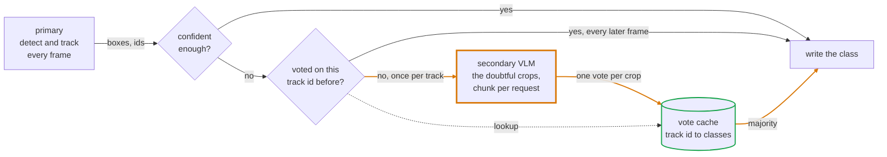

# How it works



Only the amber box costs real time, and only the bottom path reaches it. A track
takes that path on the frame it first looks doubtful and never again, because the
answer is filed under its id.

Each frame goes through three steps.

1. The primary detects and tracks. You get boxes, confidences, classes and track ids.
2. Tracks at or below `conf` are handed to the secondary. Everything above it is left alone.
3. The secondary's answer is recorded as a vote against the track id. The running
   majority overwrites the class on this frame and on every later frame, whether
   or not the secondary runs again.

Step 3 is what makes this affordable. A car the detector is unsure of, in view
for 300 frames, costs one VLM call, not 300. A car it is sure of costs none.

The refiner never adds or drops a box. It only rewrites the class, and in full
mode the box and confidence too.

## The two modes

`mode="full"` runs the secondary on the whole frame, matches its boxes to the
tracks by IoU, and takes its box, confidence and class. Use it when the secondary
localises, so Florence-2, a heavier YOLO, or any open-vocabulary detector.

```python
# a secondary box must overlap a track by iou=0.5 or more to count as the same
# object. Below that the track keeps whatever the primary gave it.
viz = vz.Vizor(primary, vz.Florence(names=names), conf=0.5, mode="full", iou=0.5)
```

`iou` is the minimum overlap for a secondary box to count as the same object as a
track. Below it, the track is left alone.

`mode="crop"` cuts each low confidence track out of the frame and asks the
secondary what it is. The box stays as the primary drew it and only the class
changes. Use it when the secondary classifies but does not localise, which is
every chat VLM.

```python
# votes=1 means one call per track for its whole life. Raise it to keep asking
# until that many answers are in, which costs more calls but survives a bad one.
viz = vz.Vizor(primary, vz.VLM("gemini-3.1-flash-lite", api="gemini"),
               conf=0.5, mode="crop", votes=1)
```

`votes` is how many answers to collect per track before the secondary stops being
asked about it. At the default of 1, each track costs exactly one call for its
whole life. Raise it to trade calls for a majority that survives one bad answer.

The old names `"image"` and `"instance"` still work and mean `"full"` and
`"crop"`.

### Not waiting for the answer

By default the frame loop stops while the secondary thinks. `workers` moves the
request to background threads and lets the loop carry on with the primary's
label. The answer is a vote against the track id, so when it arrives it corrects
that track from the next frame on.

```python
# the loop keeps running at the primary's frame rate, two requests at a time
viz = vz.Vizor(primary, secondary, conf=0.5, mode="crop", workers=2)
```

The cost is that the track wears the wrong label until the answer comes back.
Reproduce this with `python examples/workers.py`, which stands a sleeping stub in
for the secondary so the numbers do not depend on a network.

```
20 frames, a 400 ms secondary, a 30 fps primary

 workers    fps  corrected from  requests  labels
       0     19         frame 0         1  77777777777777777777
       2     30        frame 13         1  00000000000007777777
```

The blocking run holds the right label from the start and drops to 19 fps. The
background run keeps the full 30 fps and carries the primary's class 0 for 13
frames before the vote corrects it to 7. Both send one request.

A track is only asked about once at a time, so a slow answer does not pile up a
request per frame while it is outstanding. Untracked boxes are skipped entirely
under `workers`, because a late answer has nothing to attach to.

`viz.wait()` blocks until everything in flight is back. `viz.close()` stops the
threads and drops it. `Vizor` is a context manager, so a `with` block closes for
you. Only use `workers` with a secondary that is safe to call from several
threads, which a hosted API is and a single local GPU model is not.

## Batching and the crop path

In crop mode the refiner cuts out every doubtful box in the frame first, then
hands the whole list to the secondary in one call to `batch`. A secondary that
can answer about several crops at once, like [`VLM`][vizor.models.api.VLM], turns
that into one request. One that cannot gets the default
[`batch`][vizor.models.base.Model.batch], which calls `name` once per crop.

## The vote cache

[`Vote`][vizor.vote.Vote] is an LRU keyed on track id. Each id holds a bounded
deque of class ids, and the winner is the most common entry.

```python
from vizor import Vote

v = Vote(size=256, hist=25)   # remember 256 track ids, up to 25 votes each
v.add(7, 2)                   # the secondary called track 7 a class 2
v.add(7, 2)                   # and again
v.add(7, 5)                   # then once a class 5
v.get(7)                      # 2, the majority, so one odd answer does not win
```

`size` caps how many track ids are remembered at once, and the least recently
used id is dropped when it is exceeded. `hist` caps how many votes each id keeps,
so an object that changes appearance can eventually change label.

Ids below zero are ignored. Untracked boxes all carry `id = -1`, and pooling them
into one cache entry would make every untracked object share a label.
