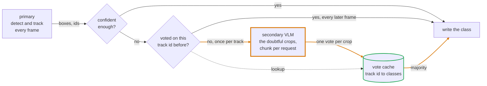
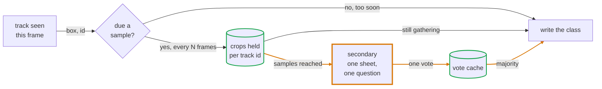

# How it works



Only the amber box costs real time, and only the bottom path reaches it. A track
takes that path on the frame it first looks doubtful and never again, because the
answer is filed under its id.

Each frame goes through three steps.

1. The primary detects and tracks. You get boxes, confidences, classes and track ids.
2. Tracks at or below `conf` are handed to the secondary. Everything above it is left alone.
3. The secondary's answer is recorded as a vote against the track id. The running
   majority overwrites the class on this frame and on every later frame, whether
   or not the secondary runs again.

Step 3 is what makes this affordable. A car the detector is unsure of, in view
for 300 frames, costs one VLM call, not 300. A car it is sure of costs none.

The refiner never adds or drops a box. It only rewrites the class, and in full
mode the box and confidence too.

## The three modes

`mode="full"` runs the secondary on the whole frame, matches its boxes to the
tracks by IoU, and takes its box, confidence and class. Use it when the secondary
localises, so Florence-2, a heavier YOLO, or any open-vocabulary detector.

```python
# a secondary box must overlap a track by iou=0.5 or more to count as the same
# object. Below that the track keeps whatever the primary gave it.
viz = vz.Vizor(primary, vz.Florence(names=names), conf=0.5, mode="full", iou=0.5)
```

`iou` is the minimum overlap for a secondary box to count as the same object as a
track. Below it, the track is left alone.

`mode="crop"` cuts each low confidence track out of the frame and asks the
secondary what it is. The box stays as the primary drew it and only the class
changes. Use it when the secondary classifies but does not localise, which is
every chat VLM.

```python
# votes=1 means one call per track for its whole life. Raise it to keep asking
# until that many answers are in, which costs more calls but survives a bad one.
viz = vz.Vizor(primary, vz.VLM("gemini-3.1-flash-lite", api="gemini"),
               conf=0.5, mode="crop", votes=1)
```

`votes` is how many answers to collect per track before the secondary stops being
asked about it. At the default of 1, each track costs exactly one call for its
whole life. Raise it to trade calls for a majority that survives one bad answer.

`mode="collage"` gathers several crops of the same track, spaced out over time,
tiles them into one image and asks about that once. Use it when one frame is not
enough to tell.

```python
# six crops of each track, eight frames apart, tiled three across
viz = vz.Vizor(primary, vz.VLM("gemini-3.1-flash-lite", api="gemini"),
               conf=1.0, mode="collage", names={0: "man", 1: "woman"},
               samples=6, every=8, cell=(96, 192), cols=3)
```

The old names `"image"` and `"instance"` still work and mean `"full"` and
`"crop"`.

### Collage mode

A crop from one frame is one glance. The person is facing away, or half behind a
car, or eight pixels of motion blur. Asking a VLM to call it from that is asking
it to guess, and a second question on a later frame only gets you a second
guess.

Collage mode gathers the glances instead. Each time a track comes round and is
due a sample, its crop is resized into a cell and kept. Once there are `samples`
of them they are tiled into one image, left to right and top to bottom, and that
image is what the secondary is asked about. One question, one answer, one vote.



With `samples=6`, `every=8` and `cols=3`, one track's sheet holds these frames.

```
+-----+-----+-----+
|  1  |  2  |  3  |     frames 0, 8 and 16
+-----+-----+-----+
|  4  |  5  |  6  |     frames 24, 32 and 40
+-----+-----+-----+
```

`samples` is how many crops make a collage and `every` is how many frames apart
they are taken. Together they set how long a track waits before it is answered.
The last crop is taken `(samples - 1) * every` frames after the first, so at the
defaults of 4 and 5 nothing is asked until a track has been in view for 15
frames. Widen `every` to cover more of the track's life and get more varied
crops, at the cost of answering later.

`cell` is the size each crop is resized into, one number for a square or a
`(width, height)` pair. People are taller than they are wide, so `(96, 192)`
wastes less of the sheet on grey bars than a square would. `cols` sets the
layout, and defaults to a square-ish grid.

This is the mode for questions the detector was never trained on, so which way
someone is facing, whether they are carrying something, which team a player is
on. The primary keeps saying `person` and the menu you hand the refiner is the
list of answers you will accept.

```python
# the detector's class list is not the menu. The VLM picks from these two.
viz = vz.Vizor(primary, secondary, conf=1.0, mode="collage",
               names={0: "man", 1: "woman"})
```

Two things follow from that. Set `conf=1.0`, because the question is not about
doubt and a confident `person` box still needs answering. And filter the primary
to the class you are asking about, or a car will come back labelled `man`, since
the refiner writes whatever id the VLM returns.

The hint the secondary is given stays in the primary's vocabulary, so it reads
`'person'` even though the menu says man or woman. That is deliberate. It tells
the model what the box was cut around without pushing it towards an answer.

Untracked boxes are skipped in this mode. Gathering crops over time needs an id
to gather them against, and `id = -1` is shared by everything the tracker has not
locked onto.

Memory is bounded. Crops are resized as they are gathered rather than at the end,
so a track part way through a collage holds a few small tiles, and `size` caps
how many tracks may be part way through at once.

Build a collage yourself with [`montage`][vizor.utils.image.montage] if you want
to see what the model is being sent.

```python
from vizor import montage

sheet = montage(crops, cols=3, cell=(96, 192))   # one BGR image
```

### Not waiting for the answer

By default the frame loop stops while the secondary thinks. `workers` moves the
request to background threads and lets the loop carry on with the primary's
label. The answer is a vote against the track id, so when it arrives it corrects
that track from the next frame on.

```python
# the loop keeps running at the primary's frame rate, two requests at a time
viz = vz.Vizor(primary, secondary, conf=0.5, mode="crop", workers=2)
```

The cost is that the track wears the wrong label until the answer comes back.
Reproduce this with `python examples/workers.py`, which stands a sleeping stub in
for the secondary so the numbers do not depend on a network.

```
20 frames, a 400 ms secondary, a 30 fps primary

 workers    fps  corrected from  requests  labels
       0     19         frame 0         1  77777777777777777777
       2     30        frame 13         1  00000000000007777777
```

The blocking run holds the right label from the start and drops to 19 fps. The
background run keeps the full 30 fps and carries the primary's class 0 for 13
frames before the vote corrects it to 7. Both send one request.

A track is only asked about once at a time, so a slow answer does not pile up a
request per frame while it is outstanding. Untracked boxes are skipped entirely
under `workers`, because a late answer has nothing to attach to.

`viz.wait()` blocks until everything in flight is back. `viz.close()` stops the
threads and drops it. `Vizor` is a context manager, so a `with` block closes for
you. Only use `workers` with a secondary that is safe to call from several
threads, which a hosted API is and a single local GPU model is not.

## Batching and the crop path

In crop mode the refiner cuts out every doubtful box in the frame first, then
hands the whole list to the secondary in one call to `batch`. A secondary that
can answer about several crops at once, like [`VLM`][vizor.models.api.VLM], turns
that into one request. One that cannot gets the default
[`batch`][vizor.models.base.Model.batch], which calls `name` once per crop.

Collage mode goes through [`grid`][vizor.models.base.Model.grid] instead, and
sends one sheet per request. Several grids in one request would ask the model to
keep the tiles and the grids straight at the same time, and collage mode already
fires once per track rather than once per frame, so the round trips are not where
the cost is. A model without a `grid` of its own falls back to `batch`, which
treats the collage as an ordinary image.

## The vote cache

[`Vote`][vizor.vote.Vote] is an LRU keyed on track id. Each id holds a bounded
deque of class ids, and the winner is the most common entry.

```python
from vizor import Vote

v = Vote(size=256, hist=25)   # remember 256 track ids, up to 25 votes each
v.add(7, 2)                   # the secondary called track 7 a class 2
v.add(7, 2)                   # and again
v.add(7, 5)                   # then once a class 5
v.get(7)                      # 2, the majority, so one odd answer does not win
```

`size` caps how many track ids are remembered at once, and the least recently
used id is dropped when it is exceeded. `hist` caps how many votes each id keeps,
so an object that changes appearance can eventually change label.

Ids below zero are ignored. Untracked boxes all carry `id = -1`, and pooling them
into one cache entry would make every untracked object share a label.
